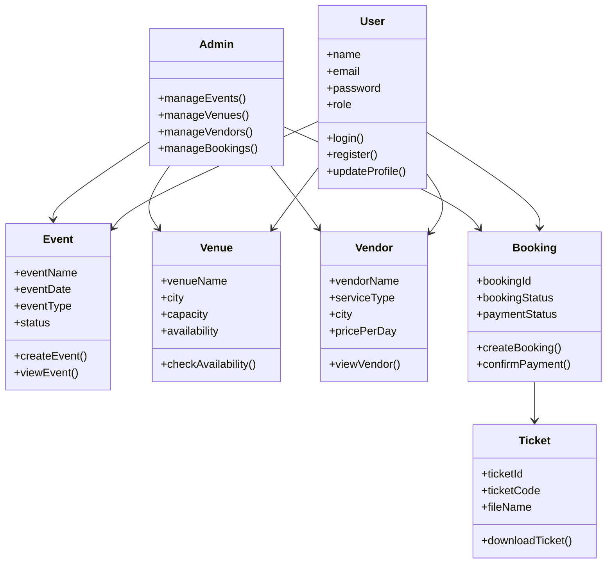
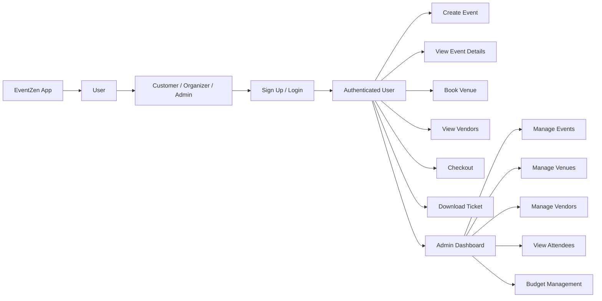
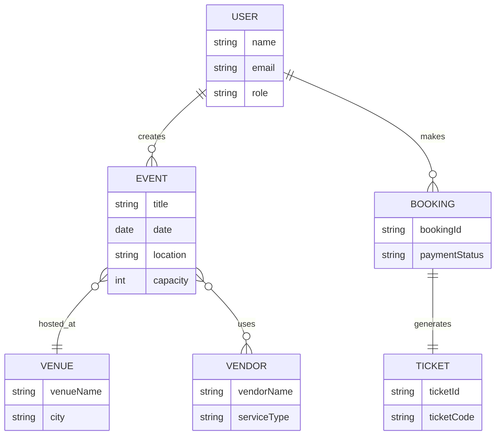

# EventZen

## Docker Setup

### Run The Full Stack

From the repo root:

```powershell
docker compose up -d --build
```

### Exposed Services

- Frontend: `http://localhost:5173`
- Auth service: `http://localhost:8081`
- Venue/vendor service: `http://localhost:3001`
- Event service: `http://localhost:3002`
- Booking service: `http://localhost:8082`
- MongoDB: `mongodb://localhost:27017`
- MySQL: `localhost:3306`

### Notes

- The compose file reuses `backend/services/auth-service/public.pem` so JWT validation stays consistent across services.
- The auth service uses the bundled RSA keypair and seeds the default admin user with:

```text
email: admin@eventzen.com
password: Admin@1234
```

- The frontend is built with Vite environment variables at image build time. If you want different public API URLs, update the `frontend` build args in [docker-compose.yml](d:\eventZen\docker-compose.yml).

### Stop The Stack

```powershell
docker compose down
```

To also remove volumes:

```powershell
docker compose down -v
```

EventZen is a full-stack event management platform built as a small microservice-based system. It combines a React frontend with dedicated backend services for authentication, event management, venue/vendor operations, and attendee booking.

The repository is organized as a polyglot workspace:

- `frontend/`: React 19 + Vite web application
- `backend/services/auth-service/`: Spring Boot auth and user management service
- `backend/services/event-service/`: Node.js/Express event management service
- `backend/services/venue-vendor-service/`: Node.js/Express venue and vendor service
- `backend/services/booking-service/`: ASP.NET Core booking and ticketing service
- `docker-compose.yml`: local full-stack orchestration

## What The Project Does

EventZen supports the main workflows needed for an event platform:

- User registration, login, token refresh, logout, password change, and profile updates
- Role-aware access for admin, organizer, customer, and related user flows
- Event creation, editing, listing, organizer-specific retrieval, search, and attendee count updates
- Venue discovery, venue availability checks, venue booking, and venue administration
- Vendor discovery, vendor onboarding, vendor updates, and hiring/contract-related flows
- Booking checkout, payment confirmation, ticket generation, ticket download, and booking history
- Admin dashboard and operational screens for events, attendees, budgets, venues, and bookings

## Architecture

The system uses one frontend and four backend services:

1. `frontend` serves the UI and calls backend APIs with environment-based base URLs.
2. `auth-service` issues and validates JWTs, manages users, seeds an admin account, and exposes a JWKS-style public key endpoint.
3. `event-service` manages event records in MongoDB and exposes public and authenticated event APIs.
4. `venue-vendor-service` manages venues, vendors, and event-related cleanup data in MongoDB.
5. `booking-service` handles checkout sessions, booking persistence, ticket PDF generation, and event cleanup for booking data.

Shared concerns:

- JWT verification across services uses the RSA public key generated or exported by `auth-service`.
- MongoDB is used by the event, venue-vendor, and booking services.
- MySQL is used by the auth service.
- Docker Compose is set up to run the entire stack locally with wired service-to-service URLs.

## UML Diagram



## User Flow Diagram



## ERD Diagram



## Tech Stack

### Frontend

- React 19
- React Router 7
- Vite 8
- Bootstrap 5

### Backend

- Spring Boot 3.2 / Java 21 / Maven
- Node.js 18+ / Express / Mongoose
- ASP.NET Core / .NET 10 / MongoDB.Driver
- MySQL 8.4
- MongoDB 7

## Repository Structure

```text
eventZen/
|-- backend/
|   `-- services/
|       |-- auth-service/
|       |-- booking-service/
|       |-- event-service/
|       `-- venue-vendor-service/
|-- docs/
|-- frontend/
|-- docker-compose.yml
`-- DOCKER.md
```

## Services And Default Ports

| Component            | Port    | Purpose                                      | Storage                                         |
| -------------------- | ------- | -------------------------------------------- | ----------------------------------------------- |
| Frontend             | `5173`  | Main web UI                                  | Browser local storage for session/cache helpers |
| Auth service         | `8081`  | Authentication, user profile, JWT issuing    | MySQL                                           |
| Event service        | `3002`  | Event CRUD and event discovery               | MongoDB                                         |
| Venue/vendor service | `3001`  | Venue and vendor management                  | MongoDB                                         |
| Booking service      | `8082`  | Checkout, booking history, ticket generation | MongoDB                                         |
| MongoDB              | `27017` | Shared document store                        | Docker volume                                   |
| MySQL                | `3306`  | Auth relational store                        | Docker volume                                   |

## Frontend Overview

The frontend lives in `frontend/` and is a Vite application with protected and public routes.

Primary routes include:

- `/`: landing page
- `/login`, `/register`
- `/dashboard`
- `/events`, `/events/new`, `/events/:id`, `/events/:id/edit`
- `/event-listing`, `/my-events`
- `/venues`, `/venues/:id`
- `/vendors`
- `/my-bookings`, `/checkout/:eventId`, `/bookings/:bookingId/ticket`
- `/attendees`
- `/admin/budgets`
- `/profile`

Frontend API base URLs are controlled through `frontend/.env.example`:

```env
VITE_AUTH_SERVICE_URL=http://localhost:8081/api/v1/auth
VITE_VENUE_VENDOR_SERVICE_URL=http://localhost:3001/api/v1
VITE_EVENT_SERVICE_URL=http://localhost:3002/api/v1
VITE_BOOKING_SERVICE_URL=http://localhost:8082/api/v1
```

Important implementation note:

- Most auth, event, venue, vendor, and booking flows are backed by live services.
- Some older attendee and compatibility flows still use browser local storage seed data in the frontend for fallback/demo behavior.

## Backend Services

### 1. Auth Service

Path: `backend/services/auth-service/`

Responsibilities:

- Register and authenticate users
- Issue access and refresh tokens
- Refresh expired access tokens through refresh-cookie flow
- Return the authenticated user profile
- Change passwords and logout users
- Update user profiles
- Seed an admin user on startup
- Expose public key material for JWT verification

Key endpoints:

- `POST /api/v1/auth/register`
- `POST /api/v1/auth/login`
- `POST /api/v1/auth/refresh`
- `POST /api/v1/auth/change-password`
- `POST /api/v1/auth/logout`
- `GET /api/v1/auth/me`
- `GET /api/v1/auth/.well-known/jwks.json`
- `PUT /api/v1/users/:id`

Core configuration comes from `backend/services/auth-service/src/main/resources/application.yml`.

Example environment variables:

```env
SERVER_PORT=8081
DB_HOST=localhost
DB_PORT=3306
DB_NAME=eventzen_auth
DB_USER=root
DB_PASSWORD=
JWT_PRIVATE_KEY=
JWT_PUBLIC_KEY=
ADMIN_EMAIL=admin@eventzen.com
ADMIN_PASSWORD=
FRONTEND_URL=http://localhost:5173
```

Notes:

- If JWT keys are left blank in development, the service can generate an RSA keypair at startup.
- Other services consume `backend/services/auth-service/public.pem` for token verification.

### 2. Event Service

Path: `backend/services/event-service/`

Responsibilities:

- Create, update, delete, and list events
- Return organizer-specific events
- Expose public upcoming events and search
- Return admin event stats
- Track attendee count adjustments

Key endpoints:

- `GET /health`
- `GET /api/v1`
- `GET /api/v1/events/upcoming`
- `GET /api/v1/events/search`
- `GET /api/v1/events`
- `GET /api/v1/events/:id`
- `GET /api/v1/events/organizer/:organizerId`
- `GET /api/v1/events/admin/stats`
- `POST /api/v1/events`
- `PUT /api/v1/events/:id`
- `DELETE /api/v1/events/:id`
- `PATCH /api/v1/events/:id/attendees`

Example environment variables:

```env
PORT=3002
NODE_ENV=development
MONGODB_URI=mongodb://localhost:27017/eventzen_events
MONGODB_TEST_URI=mongodb://localhost:27017/eventzen_events_test
JWT_PUBLIC_KEY_PATH=../auth-service/public.pem
ALLOWED_ORIGINS=http://localhost:5173,http://localhost:3000
VENUE_VENDOR_SERVICE_URL=http://localhost:3001/api/v1
```

### 3. Venue & Vendor Service

Path: `backend/services/venue-vendor-service/`

Responsibilities:

- Venue CRUD, listing, search, and availability checks
- Venue booking flows
- Vendor CRUD, listing, search, and service-specific discovery
- Vendor hire/contract-oriented flows
- Event-related data cleanup for downstream consistency

Key routes mounted under `/api/v1`:

- `/venues`
- `/vendors`
- `/events/:eventId/cleanup`
- `/events/:eventId/related-data`

Representative endpoint examples:

- `GET /health`
- `GET /api/v1/venues`
- `GET /api/v1/venues/:id`
- `GET /api/v1/venues/:id/availability`
- `POST /api/v1/venues/:id/book`
- `POST /api/v1/venues`
- `PUT /api/v1/venues/:id`
- `DELETE /api/v1/venues/:id`
- `GET /api/v1/vendors`
- `GET /api/v1/vendors/:id`
- `POST /api/v1/vendors`
- `PUT /api/v1/vendors/:id`
- `DELETE /api/v1/vendors/:id`
- `GET /api/v1/events/:eventId/related-data`

Example environment variables:

```env
PORT=3001
NODE_ENV=development
MONGODB_URI=mongodb://localhost:27017/eventzen_venue_vendor
MONGODB_TEST_URI=mongodb://localhost:27017/eventzen_venue_vendor_test
JWT_PUBLIC_KEY_PATH=../auth-service/public.pem
ALLOWED_ORIGINS=http://localhost:5173,http://localhost:3000
AUTH_SERVICE_URL=http://localhost:8081
EVENT_SERVICE_URL=http://localhost:3002
NOTIFICATION_SERVICE_URL=http://localhost:3003
```

### 4. Booking Service

Path: `backend/services/booking-service/`

Responsibilities:

- Create checkout sessions for ticket purchases
- Confirm payment and persist bookings
- Return current-user bookings
- Return recent paid bookings for admin-oriented views
- Generate ticket metadata and downloadable PDF tickets
- Clean up booking data linked to a deleted event

Key endpoints:

- `GET /health`
- `GET /api/v1`
- `POST /api/v1/bookings/checkout-sessions`
- `POST /api/v1/bookings/checkout-sessions/:sessionId/confirm`
- `GET /api/v1/bookings/me`
- `GET /api/v1/bookings/:bookingId`
- `GET /api/v1/bookings/:bookingId/ticket`
- `GET /api/v1/bookings/:bookingId/ticket/download`
- `DELETE /api/v1/bookings/events/:eventId/cleanup`

Main configuration is in `backend/services/booking-service/appsettings.json`.

Important settings:

```json
{
  "BookingDatabase": {
    "ConnectionString": "mongodb://localhost:27017",
    "DatabaseName": "eventzen_booking"
  },
  "ServiceEndpoints": {
    "AuthServiceBaseUrl": "http://localhost:8081/api/v1/auth",
    "EventServiceBaseUrl": "http://localhost:3002/api/v1",
    "FrontendBaseUrl": "http://localhost:5173"
  }
}
```

## Local Development

### Option 1: Run Everything With Docker

From the repository root:

```powershell
docker compose up -d --build
```

Services after startup:

- Frontend: `http://localhost:5173`
- Auth service: `http://localhost:8081`
- Venue/vendor service: `http://localhost:3001`
- Event service: `http://localhost:3002`
- Booking service: `http://localhost:8082`

Stop containers:

```powershell
docker compose down
```

Remove containers and volumes:

```powershell
docker compose down -v
```

### Option 2: Run Services Individually

Prerequisites:

- Node.js 18+
- Java 21
- Maven
- .NET SDK
- MongoDB
- MySQL

Recommended order:

1. Start MongoDB and MySQL.
2. Start `auth-service` first so JWT keys and auth endpoints are available.
3. Start `event-service`.
4. Start `venue-vendor-service`.
5. Start `booking-service`.
6. Start `frontend`.

#### Frontend

```powershell
cd frontend
npm install
npm run dev
```

#### Auth Service

```powershell
cd backend/services/auth-service
mvn spring-boot:run
```

#### Event Service

```powershell
cd backend/services/event-service
npm install
npm run dev
```

#### Venue-Vendor Service

```powershell
cd backend/services/venue-vendor-service
npm install
npm run dev
```

#### Booking Service

```powershell
cd backend/services/booking-service
dotnet run
```

If port `8082` is already in use:

```powershell
cd backend/services/booking-service
.\scripts\restart-service.ps1
```

## Environment Setup

Use the included example files as the starting point:

- `frontend/.env.example`
- `backend/services/auth-service/.env.example`
- `backend/services/event-service/.env.example`
- `backend/services/venue-vendor-service/.env.example`

The booking service primarily uses `appsettings.json` plus environment variable overrides.

Minimum local setup checklist:

- Frontend points to the correct API base URLs
- Auth service can reach MySQL
- Event, venue-vendor, and booking services can reach MongoDB
- Node services and booking service can read the auth public key
- CORS origins include the frontend URL

## Default Admin Account

Docker Compose seeds a default admin user for local development:

```text
email: admin@eventzen.com
password: Admin@1234
```

Update these values in environment configuration before using the project in any shared or production-like environment.

## Health Checks

Useful local checks:

- Frontend: `http://localhost:5173`
- Auth service actuator health: `http://localhost:8081/actuator/health` if exposed by Spring Boot
- Event service: `http://localhost:3002/health`
- Venue-vendor service: `http://localhost:3001/health`
- Booking service: `http://localhost:8082/health`

## Data And Storage

- MySQL database: `eventzen_auth`
- MongoDB databases:
  - `eventzen_events`
  - `eventzen_venue_vendor`
  - `eventzen_booking`

Booking-related MongoDB collections include:

- `bookings`
- `checkout_sessions`

## Security Model

- Authentication is JWT-based with RSA signing
- Refresh flow uses HTTP cookies
- Protected frontend routes enforce role checks client-side
- Backend services validate bearer tokens and enforce authorization server-side
- Shared JWT public key keeps verification consistent across services

## Developer Notes

- The frontend stores access token and user details in local storage for the current implementation.
- Some legacy compatibility modules still seed data in local storage for attendees and fallback flows.
- The Docker setup mounts `backend/services/auth-service/public.pem` into dependent services so JWT verification works consistently.
- The repository contains additional service-specific READMEs for deeper implementation details:
  - `backend/services/venue-vendor-service/README.md`
  - `backend/services/booking-service/README.md`
  - `frontend/README.md`

## Scripts Summary

### Frontend

- `npm run dev`
- `npm run build`
- `npm run lint`
- `npm run preview`

### Event Service

- `npm run dev`
- `npm start`
- `npm run lint`
- `npm test`

### Venue-Vendor Service

- `npm run dev`
- `npm start`
- `npm test`
- `npm run test:watch`
- `npm run test:coverage`
- `npm run lint`
- `npm run lint:fix`

### Booking Service

- `dotnet run`
- `.\scripts\restart-service.ps1`

### Auth Service

- `mvn spring-boot:run`
- `mvn test`

## Suggested Onboarding Flow

1. Start the stack with Docker Compose.
2. Sign in with the seeded admin account.
3. Verify auth with `/api/v1/auth/me`.
4. Create an event.
5. Browse venues and vendors.
6. Run a checkout flow for an event booking.
7. Download the generated ticket PDF.

## Documentation

- Service-specific docs:
  - `backend/services/venue-vendor-service/README.md`
  - `backend/services/booking-service/README.md`
  - `backend/services/venue-vendor-service/postman/README.md`

## Current Status

This repository already contains the core pieces of a working multi-service EventZen stack. It is especially suitable for local development, demo scenarios, and continued iteration on event operations, booking workflows, and service integration.
